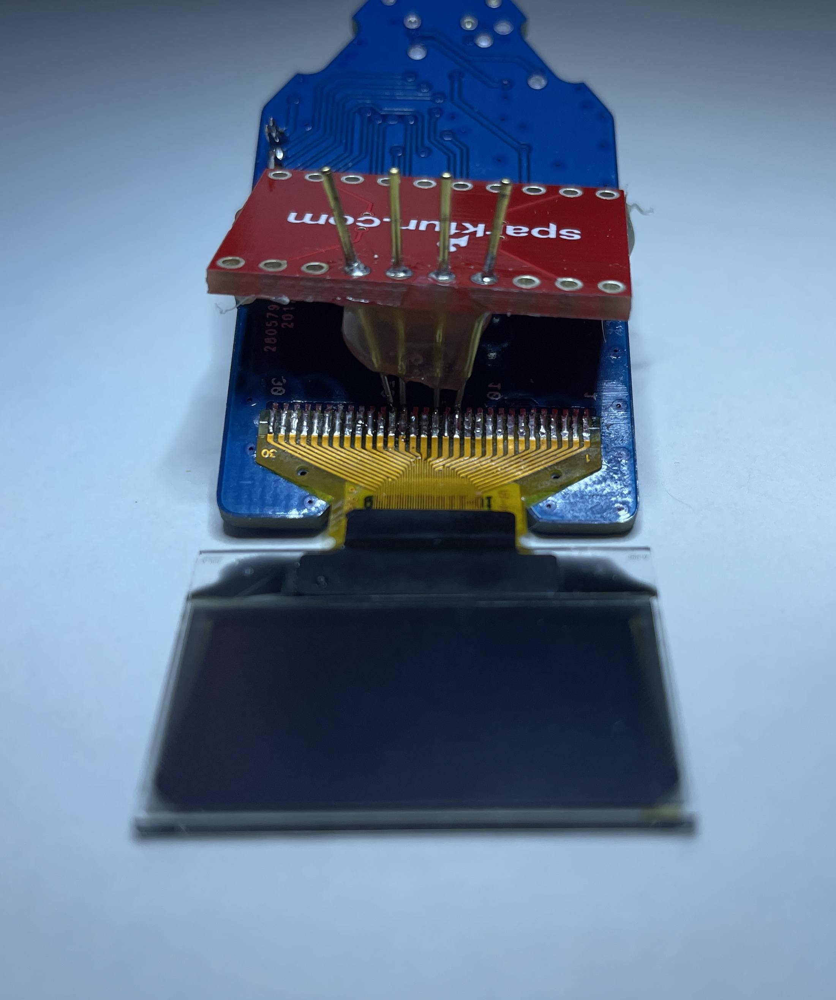
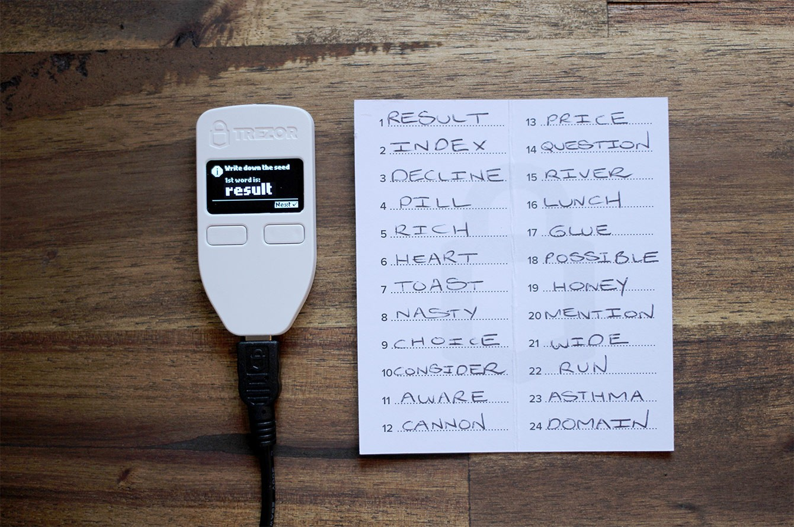
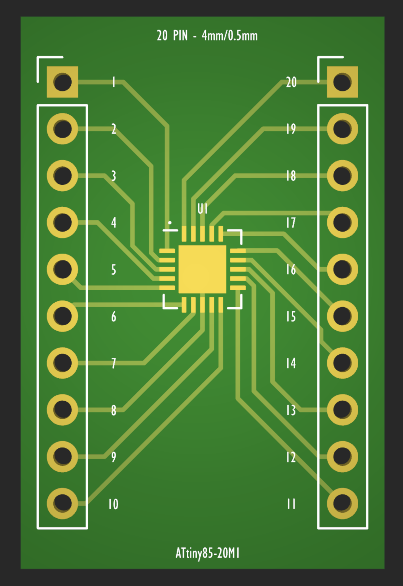

# Trezor One Benchmark

https://trezor.io/

## High-level Description of Hardware Attack
The goal of the Trezor One Benchmark is to siphon the recovery seed from a Trezor One device. This information could then be used to retrieve the original cryptocurrency passwords stored by the user. The recovery process is used in the event that the user forgets their PIN number or enters too many incorrect attempts. The user manual outlines this [recovery process](https://wiki.trezor.io/User_manual:Recovery).

During the initial startup sequence of the Trezor One, the user is instructed to write down a unique, device-generated sequence of 24 english words. Each word is displayed one at a time on the Trezor's built-in monochrome display.

This attack describes the necessary steps for capturing packets of display data and decoding them to reveal the full recovery seed.

## Data Capture
The Trezor One Victim board is equipped with a malicious ATtiny microcontroller that is attached, in a slave configuration, to the Trezor's STM32 microcontroller SPI lines. These SPI lines are also connected the the Trezor's display and are used to send bitmap image data. This configuration allows the malicious ATtiny to go undetected while still having access to all data being sent from the Trezor's microcontroller to its display.

Due to how the display operates, the Trezor's microcontroller sends a complete bitmap image to the display each time it needs to be altered, regardless of how many pixels need to change. This is beneficial because it makes it easy to decode recorded SPI packets and rebuild them into complete images. These decoded images represent exactly, pixel for pixel, what was displayed on the Trezor device at the time of packet transmission.

## Implementing the Attack

### Technical Details

#### Display Connecter Pins Table:

| PIN | <------------> | NET |
| ----------- | ----------- | ----------- |
| 12 | <------------> | GND |
| 13 | <------------> | SPI ENABLE |
| 15 | <------------> | DISPLAY DATA/COMMAND |
| 18 | <------------> | SPI CLOCK |
| 19 | <------------> | SPI DATA |

#### Trezor SSD1306 Operation
The display used is a 128x64 OLED SPI display. Internally, the display contains a single-chip driver called the SSD1306 which is widely utilized and documented. The full details of the [SSD1306 documentation](https://cdn-shop.adafruit.com/datasheets/SSD1306.pdf) are crucial to gaining a low-level understanding of this attack. 

A full screen's worth of data is sent to the display each time it is updated. At a simple level, there are 8,192 total pixels and each pixel is driven by a 1 for ON or 0 for OFF. This series of 1024 1's and 0's are sent one byte at a time via SPI to the display. However, they are not ordered left to right and top to bottom as one might expect. The full details of the pixel mapping algorithm is outlined on page 25 of the [SSD1306 documentation](https://cdn-shop.adafruit.com/datasheets/SSD1306.pdf) with regards to the display's GDDRAM. This process needs to be reversed for decoding and is exactly what is embedded in the [image_builder.py](image_builder.py) script.

Along with the 8,192 data bits that are sent to the display, there are also command sequences that are sent at the beginning of each transmission that do not represent pixel values. Outlined below is information representing the series of bits sent via SPI to the display by the Trezor. If necessary, specific command bytes can be tracked down in the [Trezor Firmware](https://github.com/trezor/trezor-mcu).

* **Setup Command Bytes (25 total)**
    * Description: The setup command bytes are sent directly after the RESET line of the display is triggered on startup. They aid in resetting the display, setting the contrast, setting the page addressing mode, etc. The exact bytes and corresponding meaning can be found in the [oled.c](https://github.com/trezor/trezor-mcu/blob/8af1f3643651e1cbee6b6196401f9c63e7cfc0f9/oled.c) file in the [Trezor Firmware](https://github.com/trezor/trezor-mcu).
    * Data: {0xAE, 0xD5, 0x80, 0xA8, 0x3F, 0xD3, 0x00, 0x40, 0x8D, 0x14, 0x20, 0x00, 0xA1, 0xC8, 0xDA, 0x12, 0x81, 0xCF, 0xD9, 0xF1, 0xDB, 0x40, 0xA4, 0xA6, 0xAF}
* **Prepended Command Bytes (3 total)**
    * Description: The prepended command bytes are sent directly before new image data is sent. For the Trezor, these bytes are always the same and can be helpful as a delimiter for debugging purposes.
    * Data: {0x00, 0x10, 0x40}
* **Pixel Value Bytes (1024 total)**
* Description: The pixel value bytes represent 1's and 0's for each of the 8,192 pixels. This means that there are 1024 SPI byte packets sent for this part of the transmission. This is the most important part of the transmission for the attack and is the only piece that needs to be recorded to EEPROM since the other pieces are constant and predictable.
* Data: {0x__, 0x__, 0x__, .......}

It is important to note that there is a signal connected to the display (DISPLAY DATA/COMMAND or D/C) that tells the display whether the incoming data is a series of command bytes or data bytes. For the Setup and Prepended Command Bytes, the D/C pin is pulled low so that the data is transferred to the SSD1306 command register. For the Pixel Value Bytes, the D/C is pulled high to be treated as data.

The order in which these command bytes and data bytes are sent is consistent:
1. The Setup Command Bytes are sent only once when the device is powered on.
1. The Preprended Command Bytes are sent before the initial screen data is sent.
1. The Pixel Value Bytes are sent as 0's (1024 bytes of 0x00) to clear the GDDRAM of the SSD1306.
1. The Preprended Command Bytes are sent before the startup screen data is sent.
1. The Pixel Value Bytes are sent to display the startup screen.
1. The previous two steps are repeated for every subsequent image displayed. This means that subsequent transmissions are a total of 1027 bytes (3 Prepend Command Bytes + 1024 Pixel Value Bytes)

Manual tests with an Arduino board and an external 128x64 OLED SPI display can be used to test what unique outputs may look like. Modify [SPI_Manual_Test.ino](/SPI_Manual_Test/SPI_Manual_Test.ino) for testing.

### Ideal Attack Sequence
1. Program the malicious ATtiny chip with firmware that enables it to record and store SPI packets to EEPROM.
1. After Trezor device is setup and functional, the malicious ATtiny chip will contain the SPI packets relating to the recovery seed image data. This means that the ATtiny device can now be connected to in some fashion that allows for its EEPROM to be extracted.
1. Enter the extracted EEPROM bytes into a .csv file.
1. Run the image builder Python script that converts the data in the .csv file to a .png image.
1. Repeat the previous step until all images representing each word in the recovery seed are created.
1. Use the recovery seed to gain access to the information on the Trezor device by following the [recovery process](https://wiki.trezor.io/User_manual:Recovery).

### Proof of Concept Attack Sequence
To prove that this ideal attack sequence is possible, various methods and tools were used to extract test data from a from both a real Trezor One and a Trezor victim board.

First, a Trezor victim board was populated. Firmware was built and uploaded by following the [Trezor One Dev Kit](https://mcudev.github.io/trezor-dev-kit/) documentation. Once the device is set up, you must navigate to trezor.io/start and follow the instructions. Unfortunately, this process involves updating the firmware which seems to halt any progress past this point. After the forced update, the Trezor displays an "Unknown bootloader detected" warning and does not work. However, for the purposes of the proof of concept, this limitation was ignored because the SPI data packets used to display the startup screen and "Unknown bootloader detected" warning are of the same format as the packets used to display all content (including the recovery seed words).

Next, a logic analyzer was connected to the necessary pins on the display connector (see Technical Details) using an improvised connector. The HEX values sent over the SPI data line were then exported to the [startup_spi_data.csv](startup_spi_data.csv) file. The beginning and ending of the 1024 bytes representing each displayed image were then set manually in the [image_builder.py](image_builder.py) file. At this point in testing, the Trezor victim board displayed two images on startup. The first was a lock icon and the second was the "Unknown bootloader detected" warning. Setting and running the python script for both sets of 1024 bytes in the .csv file resulted in the [Lock Screen Image](lock_screen.png) and [Info Screen Image](info_screen.png) being generated.

To prove that these results were relevant to a real Trezor, the improvised connector was placed on a geniune Trezor One. Using a logic analyzer in the same fashion resulted in the [real_trezor_startup.csv](real_trezor_startup.csv) file. After setting the start and end rows of the SPI data relating to the startup screen, the python script produced the [real_trezor_startup.png](real_trezor_startup.png) image.

### Further Implementation

Currently, there is one gap between the proof of concept and the ideal attack sequence. In the proof of concept, the SPI data was captured with a logic analyzer and then exported to .csv file. In the ideal attack sequence, the ATtiny captures the data and the user then connects to the ATtiny to extract the recorded data from EEPROM.

Firmware for the ATtiny needs to be written that implements it as an SPI slave. Since the general purpose SPI library does not support the ATtiny85 being used, a more primitive script must be used. Refer to this [stackexchange post](https://electronics.stackexchange.com/questions/60114/spi-h-for-attiny) for ideas.

Once this is implemented, the next immediate problem is EEPROM space. It must be noted that the data has to be held in EEPROM because it needs to be stored in non-volatile memory. The Trezor will be powered off before the data extraction from the ATtiny occurs. It seems that the ATtiny85 has 512 bytes of EEPROM. Unfortunately, this is nowhere near sufficient for this application. Ideally, 24,576 bytes (24 recovery screens * 1024 bytes per display image) would be available to record the SPI data to. This also assumes that the ATtiny is equipped with code that knows exactly which SPI packets will represent the 24 recovery screens that need to be recorded. On the surface, this may seem simple to account for. In the startup sequence, the recovery screens should always be the Nth screen to be displayed. The ATtiny would then be able to count packets until it gets to the Nth screen. However, this may not work because of variants such as the unnecessary button presses from the user that result in extra screens being displayed. Therefore, a better method will probably have to be utilized. One method would be to figure out if the recovery screens have a special, unique design. For example, as shown in this [photo](trezor-one-confirm-seed.jpeg), the ATtiny could be programmed with a bitmap that has the correct bytes representing "Write down the seed" and "Nth word is:." These could then be compared with the most recently recorded packet to decide whether or not the packet represent a recovery screen. Furthermore, this method can also help reduce necessary EEPROM space. It can be noted than in the [photo](trezor-one-confirm-seed.jpeg), takes up at most 1/3 of the vertical space and slightly more than 1/2 of the horizontal space. While this can't solve the 512 byte limitation, it can greatly reduce the EEPROM size needed to well under 24,576 bytes. Since the final EEPROM size needed will be greater than the currently available 512 bytes in the ATtiny85, there are two options. The first is to choose another microcontroller with a larger EEPROM. The second option would be to add an external EEPROM chip which is cheap and offers a tremendous amount of storage. However, one caveat of the latter method is that the external EEPROM would need to be connected over SPI. This may potentially pose a problem because the microcontroller would have to act as both and SPI slave for the STM32 and a master for the external EEPROM.

### ATtiny85-20M1 Breakout Board

In order to upload code to this ATtiny85 package for testing, a custom breakout board is needed. This is because the footprint is unique and compatible breakout boards are difficult to find online. This breakout board was designed in KiCad and an image of the board along with the pinout information is listed below. All design files can be found [here](attiny85_breakout_board).

| Header Pin | ATtiny85 Pin | Connection |
| ----------- | ----------- | ----------- |
| 1 | 1 | RESET/PB5 |
| 2 | 2 | XTAL1/PB3 |
| 5 | 5 | XTAL2/PB4 |
| 8 | 8 | GND |
| 11 | 11 | AREF/PB0 |
| 12 | 12 | PB1 |
| 14 | 14 | PB2 |
| 15 | 15 | VCC |

